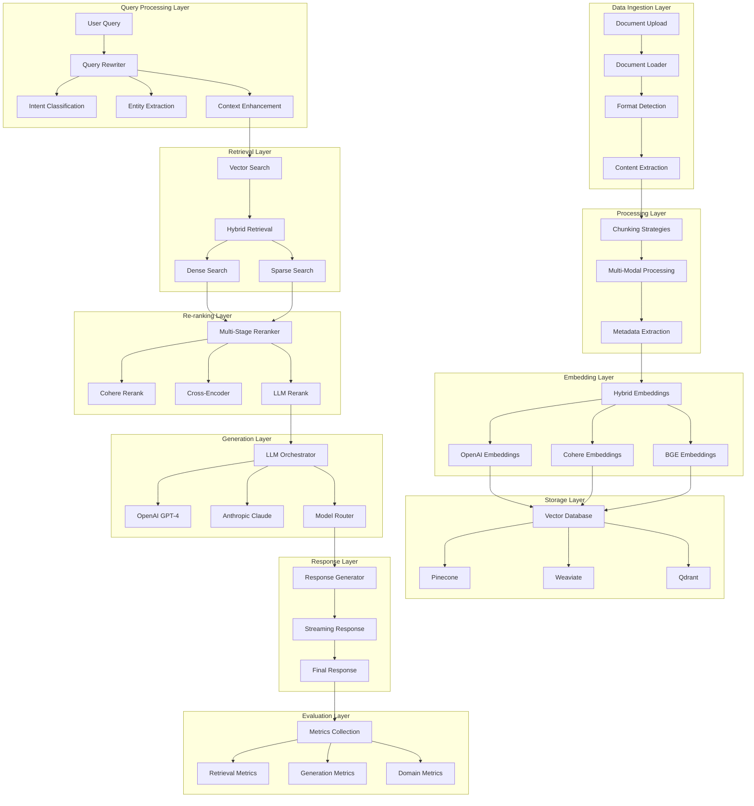
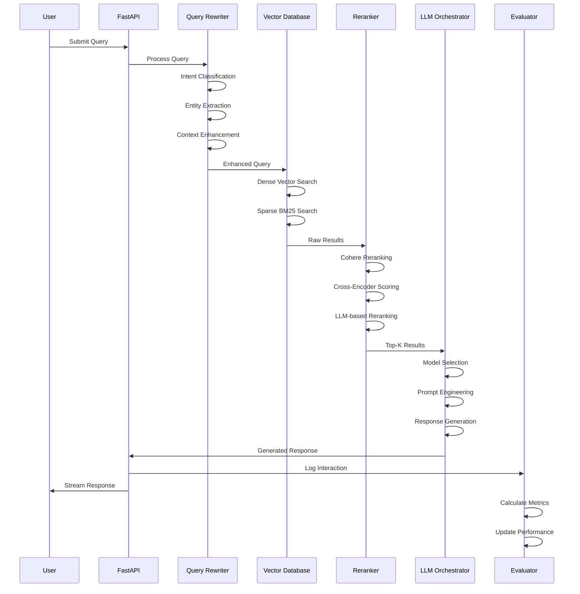
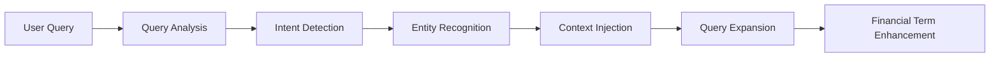
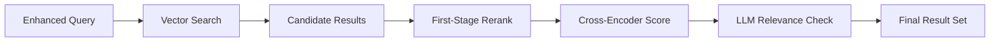

# Finance RAG Pipeline - Architecture & Data Flow

## 🏗️ System Architecture Overview



## 📊 Data Flow Diagram



## 🗂️ Directory Structure & Components

```
finace_data_rag/
│
├── 📁 src/                          # Core application code
│   ├── 📁 api/                      # FastAPI REST API
│   │   └── main.py                  # API endpoints & routing
│   │
│   ├── 📁 data_processing/          # Document processing pipeline
│   │   ├── document_loader.py       # Multi-format document loading
│   │   └── chunking_strategies.py   # Advanced chunking algorithms
│   │
│   ├── 📁 embeddings/               # Embedding generation
│   │   └── hybrid_embeddings.py    # Multi-provider embeddings
│   │
│   ├── 📁 vector_db/               # Vector database abstraction
│   │   └── vector_store_factory.py # Unified DB interface
│   │
│   ├── 📁 retrieval/               # Query processing & retrieval
│   │   ├── query_rewriter.py       # Intelligent query enhancement
│   │   └── reranker.py             # Multi-stage result reranking
│   │
│   ├── 📁 llm/                     # Language model integration
│   │   └── llm_factory.py          # Multi-LLM orchestration
│   │
│   └── 📁 evaluation/              # Performance evaluation
│       └── comprehensive_metrics.py # End-to-end metrics
│
├── 📁 config/                      # Configuration management
│   └── settings.yaml               # Application settings
│
├── 📁 docker/                      # Containerization
│   ├── Dockerfile                  # Application container
│   └── docker-compose.yml          # Multi-service setup
│
├── 📁 docs/                        # Documentation
│   ├── README.md                   # Project overview
│   ├── ARCHITECTURE.md             # This file
│   ├── RAG_COMPONENT_GUIDE.md      # Component details
│   └── IMPLEMENTATION_SUMMARY.md   # Implementation notes
│
└── 📁 cli/                         # Command-line tools
    └── cli.py                      # Document processing CLI
```

## 🔄 Component Interaction Flow

### 1. Document Processing Pipeline


### 2. Query Processing Pipeline


### 3. Retrieval & Ranking Pipeline


### 4. Generation Pipeline


## 🎯 Key Design Principles

### 1. **Modularity**
- Each component is independently replaceable
- Clear interfaces between layers
- Plugin-based architecture for extensibility

### 2. **Scalability**
- Horizontal scaling through Docker containers
- Async processing with FastAPI
- Distributed vector database support

### 3. **Observability**
- Comprehensive logging at each stage
- Performance metrics collection
- Real-time monitoring capabilities

### 4. **Reliability**
- Graceful degradation with fallback models
- Retry mechanisms for external APIs
- Circuit breaker patterns for resilience

## 📈 Performance Characteristics

### Throughput Expectations
- **Document Processing**: 100 pages/minute
- **Query Response**: < 2 seconds (95th percentile)
- **Concurrent Users**: 100+ with proper scaling
- **Embedding Generation**: 1000 chunks/minute

### Resource Requirements
- **Memory**: 8GB minimum, 16GB recommended
- **CPU**: 4 cores minimum, 8 cores recommended
- **Storage**: 50GB for vector indices, 100GB for document storage
- **Network**: Stable internet for API calls

## 🔧 Configuration Flow

### Environment-Based Configuration
```yaml
# Development
- Local vector DB (Qdrant)
- OpenAI embeddings only
- Single LLM model
- Detailed logging

# Production
- Cloud vector DB (Pinecone)
- Multi-provider embeddings
- LLM load balancing
- Optimized logging
```

### Feature Toggles
- **Embedding Providers**: Enable/disable providers
- **Reranking Stages**: Configure reranking pipeline
- **LLM Models**: Select available models
- **Evaluation**: Toggle metrics collection

## 🚀 Deployment Architecture

### Development Environment
```
Developer Machine
├── Local Qdrant (Docker)
├── Redis Cache
├── FastAPI (uvicorn)
└── CLI Tools
```

### Production Environment
```
Cloud Infrastructure
├── Load Balancer
├── API Containers (3x)
├── Vector Database (Pinecone)
├── Redis Cluster
├── Monitoring Stack
└── Document Storage (S3)
```

## 🔍 Monitoring & Observability

### Metrics Tracked
- **Latency**: Query processing time
- **Throughput**: Requests per second
- **Accuracy**: Retrieval and generation quality
- **Cost**: API usage and compute costs

### Alerting
- High error rates
- Increased latency
- API quota limits
- Storage capacity

This architecture provides a robust, scalable foundation for processing and querying large volumes of financial documents while maintaining high performance and accuracy standards.
